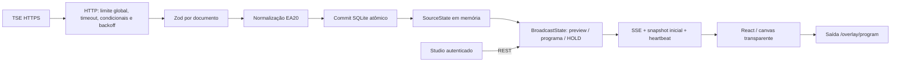

# Arquitetura

O processo é persistente. Um scheduler não sobreposto ingere somente combinações ativas (programa e preview), usando uma fila global HTTP. Configuração e município são resolvidos antes de consultar resultados. O EA11 fornece os diretórios parametrizados. IDs conhecidos ficam centralizados em ElectionConfig, mas recursos de resultado exigem configuração validada.

`packages/tse`: schemas, URLs, ingestão, HTTP, fotos e gerador mock. `packages/core`: repositório e freshness. `packages/broadcast`: estado e SSE. `packages/shared`: modelos, validações e formatação. `apps/server`: configuração, autenticação e rotas. `apps/web`: mesmo renderizador para preview e output e interface do operador.

## Persistência e origem

Migrations numeradas são aplicadas em transação. SQLite usa WAL, synchronous FULL e busy timeout. Armazena configurações, cache HTTP, snapshots completos, auditoria das operações e logs de fetch. Snapshots são limitados aos últimos 120 por recurso; fetch_log aos últimos 20 mil registros. A exportação usa SQLite Backup API, não cópia insegura de um arquivo WAL em uso.

O programa é separado do preview e dos dados eleitorais. TAKE copia a composição validada para o programa. HOLD persiste uma cópia dos dados exibidos; CLEAR altera apenas a visibilidade. Alterações de dados não fazem TAKE automaticamente de uma cena nova. Resultados do mesmo cargo/abrangência seguem atualizando o programa enquanto HOLD estiver desativado.

Um novo EA20 só é publicado depois de validar todo o documento, contexto, candidatos e seções, normalizar e confirmar a gravação SQLite. Hash igual não cria nova revisão eleitoral. Timestamp claramente anterior para o mesmo recurso é rejeitado. IDG é conservado para proveniência, não tratado como contador entre arquivos.

## Rede e recuperação

SSE envia envelope completo com estado + snapshot correspondente. Cada processo tem um epoch, cada mudança uma sequência. O cliente descarta sequência inferior no mesmo epoch, aceita snapshot inicial após reinício e mantém os dados visíveis durante desconexões. Não é necessário replay de todos os eventos porque a mensagem inicial representa o estado integral. Heartbeat de 15 segundos; clientes lentos são desconectados para evitar crescimento ilimitado de memória.

O cache HTTP mantém ETag e Last-Modified apenas após JSON/schema válidos. 304 usa o corpo validado anterior. Falhas não sobrescrevem snapshots. 403/429 suspendem globalmente por pelo menos 10 minutos; Retry-After pode ampliar esse prazo. 404 recebe cooldown de um minuto; 5xx/timeouts têm retry limitado e backoff. Fotos passam pela mesma fila e são baixadas sob demanda para candidatos visíveis/selecionados, sem polling.

O renderer usa chaves por sqcand, FLIP para reordenação, transições CSS de largura em escala 0–100 e interpolação numérica curta. O canvas é 1920×1080 com escala proporcional ao viewport. Redução de movimento é respeitada.

## Limites operacionais

A sessão não é compartilhada entre vários processos: execute uma instância por base/porta. Não há controle automático de failover de hardware.

O sistema não conversa com nenhum programa de transmissão: não há API interna,
nem botão que controle nada fora daqui. A integração é apenas a URL `/overlay/program`,
que alguém cola em outra máquina. Uma conexão SSE confirma que um cliente de
saída está conectado, o que **não** comprova que ele está no ar na transmissão.
A confirmação continua sendo visual, no monitor.
